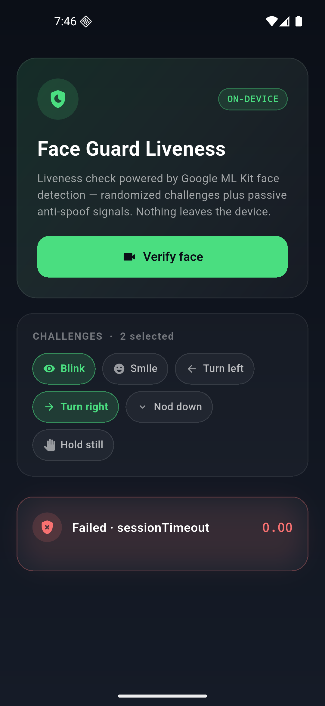
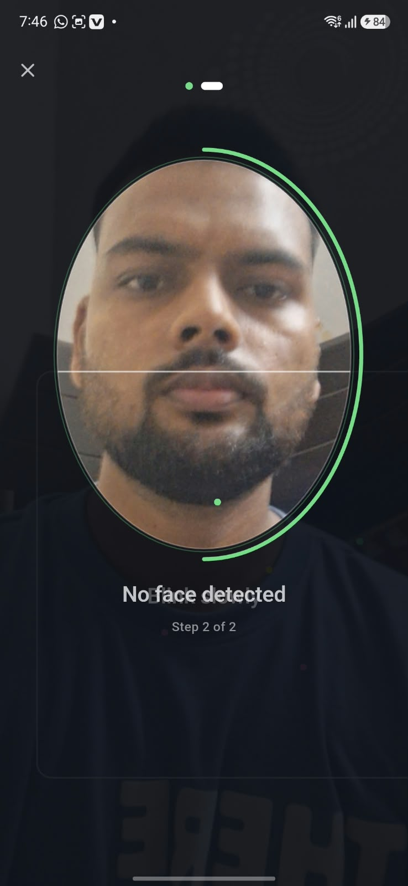
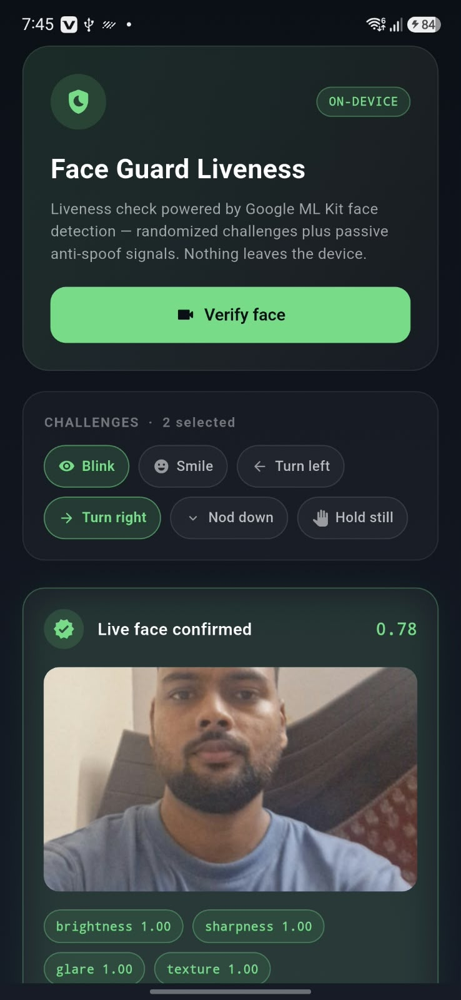
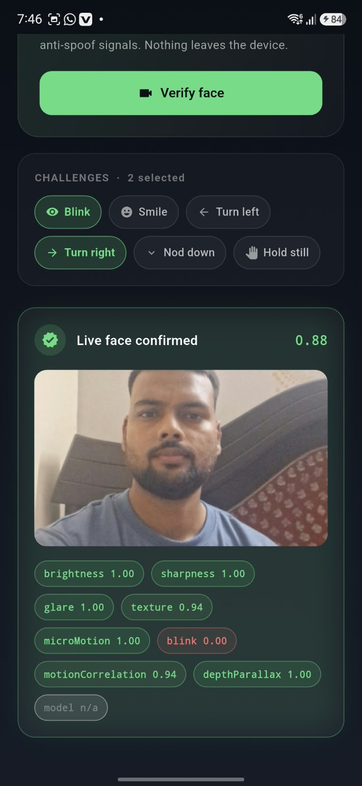

# flutter_face_liveness_detection

On-device face liveness detection for Flutter. Randomised active challenges
plus a multi-signal passive anti-spoof analyzer. No network calls, no SDK keys,
no per-verification pricing.

Written from scratch on top of Google ML Kit face detection. You own this code.

<p>
  
  
  
  
</p>

## What it checks

Active challenges (order shuffled every session, so a pre-recorded video can't
be replayed):

- blink, smile, turn left, turn right, look down, hold still

Passive signals, scored in parallel while the challenges run:

| Signal | Attack it targets |
| --- | --- |
| `brightness` | frames too dark or blown out to judge |
| `sharpness` | photo-of-a-photo, out-of-focus print |
| `glare` | face shown on another phone or monitor |
| `texture` | flat print with reduced skin detail |
| `microMotion` | a frozen frame injected by a virtual camera |
| `blink` | still photo held up to the lens |
| `motionCorrelation` | photo panned in front of a moving phone (gyro cross-check) |
| `depthParallax` | anything flat, including a high-res tablet |
| `model` | your own TFLite/Core ML network, if you plug one in |

Each signal returns 0 (spoof) to 1 (live) plus an `available` flag. Signals
that couldn't run are dropped and the remaining weights renormalise, so a
device without a gyroscope still gets a fair score.

On top of that, a separate **mask check** runs every frame outside the signal
score: a worn mask flattens the texture over the nose/mouth relative to the
eyes/forehead, which ML Kit's landmark points don't reliably expose (they're
estimated from the face box, not occlusion-aware). If enough frames look
masked - either several in a row, or too large a fraction of the whole
session - the session fails immediately with `LivenessFailure.maskDetected`:
no more challenges, no captured photo.

Face detection itself runs in ML Kit's `fast` performance mode by default, for
quicker per-frame turnaround on mid-range devices.

## Install

```yaml
dependencies:
  flutter_face_liveness_detection: ^0.2.3
```

Android — `android/app/src/main/AndroidManifest.xml`:

```xml
<uses-permission android:name="android.permission.CAMERA" />
```

`minSdkVersion 21` and ML Kit needs `android/app/build.gradle` to keep
`multiDexEnabled true` if you're near the method limit.

iOS — `ios/Runner/Info.plist`:

```xml
<key>NSCameraUsageDescription</key>
<string>Used to verify that a real person is present.</string>
```

## Use

```dart
final result = await Navigator.of(context).push<LivenessResult>(
  MaterialPageRoute(
    builder: (_) => LivenessScreen(
      config: LivenessConfig(
        challengeCount: 3,
        livenessThreshold: 0.62,
      ),
    ),
  ),
);

if (result != null && result.isLive) {
  print(result.livenessScore);
  print(result.capturedImagePath);
}
```

Headless, if you want your own UI:

```dart
final controller = LivenessController(config: const LivenessConfig());
await controller.initialize();
controller.addListener(() => print(controller.value.message));
final result = await controller.start();
await controller.dispose();
```

## Capture and the on-screen oval

By default the final still is cropped down to just the oval the user was
asked to sit inside - everything outside it is painted black - not the full
camera frame.

| Option | Default | Effect |
| --- | --- | --- |
| `requireFaceInOval` | `false` | treat a face outside the oval like "no face": challenges won't advance and the still won't be captured until it's recentred |
| `cropToFace` | `true` | crop the captured still instead of keeping the full frame |
| `ovalCrop` | `true` | shape that crop to the oval (black outside the ellipse) instead of a padded rectangle around the face box |
| `faceCropPadding` | `0.4` | margin around the face box, as a fraction of its size - only used when `ovalCrop` is `false` |
| `ovalWidthFraction` | `0.72` | oval width as a fraction of the screen/frame width |
| `ovalHeightRatio` | `1.32` | oval height as a multiple of its own width |
| `ovalCenterYFraction` | `0.4` | oval's vertical center as a fraction of height, from the top |
| `captureCropScale` | `1.0` | shrinks/grows just the captured still's crop area around the oval's center, independent of the on-screen oval size - e.g. `0.8` for a tighter final photo without changing the guide the user sees |

```dart
LivenessConfig(
  requireFaceInOval: true,
  ovalWidthFraction: 0.8,
  captureCropScale: 0.85,
)
```

Set `cropToFace: false` to go back to saving the full camera frame.

`LivenessScreen(showCapturedImagePreview: true)` shows a thumbnail of the
captured still on the result card once the session passes (default `false`).

## Tuning

`livenessThreshold` is the one knob that matters. Start at 0.62, then run your
own bench: 50 real faces and 50 spoof attempts (print, phone screen, laptop
screen), log `result.toMap()` for each, and move the threshold to where your
false-reject and false-accept rates balance for your risk appetite.

`SignalWeights` lets you re-rank the signals. If your users are often in poor
light, drop `brightness` and `sharpness` weight and lean on `depthParallax`
and `motionCorrelation`, which are the two hardest to fake.

Mask detection is heuristic (texture, not a trained classifier) - tune it on
your own devices/lighting before shipping:

| Option | Default | Effect |
| --- | --- | --- |
| `enableMaskDetection` | `true` | turn the check off entirely |
| `maskDetectionFrames` | `5` | consecutive/sticky suspected frames before an early fail |
| `maskTextureRatio` | `0.85` | lower-face-vs-upper-face stdDev ratio below this counts as flat |
| `maskEntropyDrop` | `0.3` | required entropy drop (upper minus lower) alongside the ratio |
| `maskSessionFraction` | `0.3` | session-wide fallback: this fraction of all frames looking masked also fails, even if the streak never latched |

If it's firing on bare faces, raise `maskTextureRatio` down or `maskEntropyDrop`
up (stricter). If it's missing real masks, loosen the same two the other way,
or lower `maskSessionFraction`.

## Adding a trained model

The heuristics catch casual attacks. For a stronger passive check, implement
`AntiSpoofModel` with a silent-face network and pass it in — it becomes one
more weighted signal, it doesn't replace the rest.

```dart
class TflAntiSpoof implements AntiSpoofModel {
  @override
  Future<double> scoreFrame(LumaImage luma, FrameSample sample) async {
    // crop luma to sample.faceBox, resize to your model input, run, return 0..1
  }
}

LivenessScreen(model: TflAntiSpoof());
```

## Limits worth knowing

This runs entirely on the client, so it protects against someone holding up a
photo — not against someone who has rooted the device and patched the app, or
piped a virtual camera into it. For KYC, banking, or anything where money moves
on the result, treat this as a filter, not the decision: send the captured
frames to your server and re-verify there.

The `depthParallax` and `motionCorrelation` signals need the head to actually
sweep, which is why `alwaysIncludeYawSweep` defaults to true. Turn it off and
those two signals will usually report unavailable.

## Renaming

Everything keys off the package name in `pubspec.yaml`. To rename:

1. change `name:` in `pubspec.yaml`
2. rename `lib/flutter_face_liveness_detection.dart` to match
3. find-and-replace `flutter_face_liveness_detection` across the repo

No native code or platform channels to touch.
